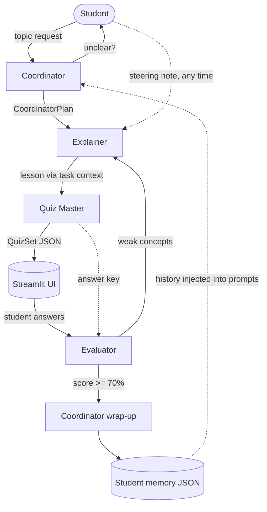

# Leo - Multi-Agent AI Tutor

[](https://leo-ai-tutor.streamlit.app/)
[](https://drive.google.com/file/d/1jTT16EThhXd1ocoeHnILOf2EmcrIMgfO/view?usp=sharing)

Leo is a study assistant built with CrewAI where four specialized agents collaborate to teach you. They work together to plan a lesson, explain concepts, give a quiz, grade your answers, and even re-teach weak spots before wrapping up. You interact with them through a Streamlit interface that shows you exactly which agent is currently working.

## Agents

| Agent       | Role                                                                                                                                   | Output                           |
| ----------- | -------------------------------------------------------------------------------------------------------------------------------------- | -------------------------------- |
| Coordinator | Interprets your request, asks a clarifying question if it's vague, builds the teaching plan, handles failures, and writes the wrap-up. | Structured plan and wrap-up text |
| Explainer   | Teaches the topic at your level. If you struggle, it re-teaches weak concepts using a different approach.                              | Markdown lesson                  |
| Quiz Master | Writes multiple-choice and short-answer questions based on the lesson.                                                                 | Structured quiz format           |
| Evaluator   | Grades your answers against the Quiz Master's key, explains mistakes, and highlights weak concepts.                                    | Structured evaluation            |

Each agent has its own role, goal, backstory, and prompt template defined in `leo/prompts.py`.

## Architecture



## How It Works

The app uses a sequential pipeline where a coordinator leads the process, but there is also a helpful feedback loop:

1. The Coordinator plans the lesson (or asks you to clarify if needed).
2. The Explainer and Quiz Master run together. The lesson is passed directly to the Quiz Master so it can generate relevant questions.
3. You answer the questions, and the Evaluator checks them using the Quiz Master's answer key.
4. If your score is below 70%, the Evaluator sends your weak concepts back to the Explainer for a new lesson and quiz (up to 3 rounds).
5. You can steer the agents anytime using the sidebar, and your instructions are passed along to them.

The system is designed to handle failures gracefully. If an agent runs into an issue, the Coordinator steps in to report a clear message instead of crashing.

## Memory

The app keeps track of your past topics, scores, and areas where you struggled. This information is saved in `data/<student>.json` and is used to personalize future lessons.

## Running the App

Since CrewAI currently works best with Python 3.10 to 3.13, you should use Python 3.13 for your virtual environment.

```bash
# On Windows
py -3.13 -m venv .venv
.venv\Scripts\activate

# On Mac/Linux
python3.13 -m venv .venv
source .venv/bin/activate
```

Next, install the dependencies and set up your environment variables:

```bash
pip install -r requirements.txt
cp .env.example .env
```

Make sure to edit the `.env` file to add your `GROQ_API_KEY`. (Never commit this file!)

Finally, start the application:

```bash
streamlit run app.py
```

You can change the underlying model by modifying the `LEO_MODEL` in your `.env` file. It uses LiteLLM-style names, defaulting to `groq/openai/gpt-oss-120b`.

## Project Structure

- `app.py`: The Streamlit interface and application logic.
- `leo/prompts.py`: Prompt templates for each agent role.
- `leo/agents.py`: Setup for agents and their tasks.
- `leo/orchestrator.py`: The main pipeline, retries, and feedback loop.
- `leo/schemas.py`: Data structures used to pass information between agents.
- `leo/memory.py`: Handles saving and loading student progress.

## Author

[Mehedi Hossen Fahim](https://www.linkedin.com/in/mehedihossenfahim/)
